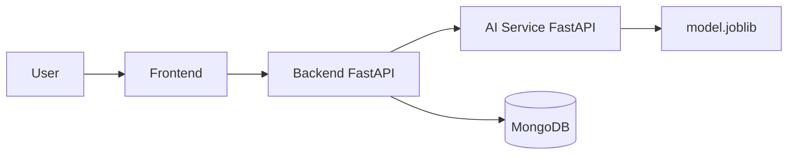

# California Housing Price Prediction

## 1. Giới thiệu đề tài

Dự án này xây dựng hệ thống dự đoán giá nhà California bằng cách kết hợp quy trình học máy, API, và ứng dụng web chạy trên Docker. Mục tiêu là chuyển mô hình từ notebook Colab sang sản phẩm có thể dùng thực tế với các endpoint rõ ràng, nhật ký theo `request_id`, lưu lịch sử dự đoán và khả năng triển khai qua tunnel/ngrok hoặc Docker Compose trên máy cục bộ.

## 2. Mục tiêu và phạm vi bài tập

- Tạo mô hình hồi quy dự đoán `median_house_value` từ dataset California Housing.
- Đóng gói model dưới dạng file `model.joblib` có kèm `schema.json` và `metadata.json`.
- Thiết kế kiến trúc 3 tầng: AI Service, Backend, Frontend.
- Đưa toàn bộ hệ thống lên Docker Compose với MongoDB.
- Đảm bảo luồng dữ liệu FE → BE → AI Service → FE hoạt động đúng, có log mã request và lưu lịch sử dự đoán vào MongoDB.

## 3. Tóm tắt kiến trúc hệ thống



- AI Service: nạp model khi khởi động container.
- Backend: validate đầu vào theo `schema.json`, gọi AI Service, lưu lịch sử dự đoán.
- Frontend: form nhập dữ liệu, gửi lên backend và hiển thị kết quả.

## 4. Dữ liệu và mô hình

Dataset được dùng là California Housing, gồm các đặc trưng chính như:

- `longitude`, `latitude`
- `housing_median_age`
- `total_rooms`, `total_bedrooms`
- `population`, `households`
- `median_income`
- `ocean_proximity`
- `median_house_value` (biến mục tiêu)

Mô hình được lưu ở:

- `ai-models/models/model.joblib`
- `ai-models/models/schema.json`
- `ai-models/models/metadata.json`

## 5. Cấu trúc thư mục dự án

```text
.
├── .env.example
├── docker-compose.yml
├── README.md
├── ai-models/
│   ├── data/
│   ├── models/
│   ├── requirements.txt
│   ├── service/
│   └── colab/
├── app/
│   ├── backend/
│   └── frontend/
├── docs/
└── .gitignore
```

## 6. Thiết lập môi trường

Yêu cầu:

- Docker + Docker Compose
- Git
- Python 3.12 (cho môi trường phát triển cục bộ)

Tạo file biến môi trường từ mẫu:

```bash
cp .env.example .env
```

Các biến môi trường chính:

```env
AI_SERVICE_URL=http://ai-service:8001
API_URL=http://localhost:8000
FRONTEND_URL=http://localhost:3000
MONGODB_URI=mongodb://mongodb:27017
MONGODB_DATABASE=cali_house_db
MONGODB_COLLECTION=predictions
```

## 7. Chạy dự án bằng Docker

Từ thư mục gốc của dự án:

```bash
docker compose up --build
```

Sau khi khởi động, các service sẽ có sẵn tại:

- AI Service: http://localhost:8001
- Backend: http://localhost:8000
- Frontend: http://localhost:3000
- MongoDB: mongodb://localhost:27017

Kiểm tra sức khỏe từng service:

```bash
curl http://localhost:8001/health
curl http://localhost:8000/health
curl http://localhost:3000/health
```

## 8. API contract

### AI Service

- `GET /health`
- `GET /model-info`
- `POST /predict`

Ví dụ request:

```json
{
  "features": {
    "longitude": -118.24,
    "latitude": 34.05,
    "housing_median_age": 30,
    "total_rooms": 2400,
    "total_bedrooms": 500,
    "population": 1200,
    "households": 400,
    "median_income": 4.5,
    "ocean_proximity": "NEAR BAY"
  }
}
```

Ví dụ response:

```json
{
  "prediction": 432500.0,
  "model_version": "1.0.0",
  "request_id": "abc123",
  "target_column": "median_house_value"
}
```

### Backend

- `GET /health`
- `GET /model-info`
- `GET /api/history`
- `POST /api/predict`

Dữ liệu đầu vào được validate theo `schema.json` trước khi forwarded tới AI Service.

## 9. Luồng dự đoán và lưu lịch sử

Luồng hoạt động như sau:

1. Frontend hiển thị form nhập dữ liệu.
2. Frontend gửi `POST /api/predict` tới backend.
3. Backend validate dữ liệu theo `schema.json`.
4. Backend gọi AI Service `POST /predict`.
5. AI Service tính toán bằng model đã nạp sẵn khi khởi động.
6. Backend lưu record vào MongoDB và trả kết quả cho frontend. 
7. Mỗi request có `request_id` được log rõ ràng để dễ debug và bảo vệ demo.

## 10. Hướng dẫn cập nhật tunnel/ngrok

Khi đã public hệ thống qua tunnel hoặc ngrok, cần cập nhật địa chỉ mới trong `.env` và khởi động lại services nếu cần. Ví dụ:

```env
AI_SERVICE_URL=https://<your-ngrok-id>.ngrok-free.app
API_URL=https://<your-backend-domain>.ngrok-free.app
FRONTEND_URL=https://<your-frontend-domain>.ngrok-free.app
```

Lưu ý:

- Nếu ngrok đổi link sau mỗi lần khởi động, cần cập nhật lại `.env` và ghi log thời gian đổi link.
- Đối với báo cáo và demo, nên ghi rõ lần cập nhật mới nhất và link đang dùng.

## 11. Dùng thử trên trình duyệt

Mở URL:

```text
http://localhost:3000
```

Nhập các giá trị ví dụ rồi nhấn Predict. Hệ thống sẽ hiển thị giá ước lượng theo USD và log `request_id` trên console server.

## 12. Kiểm tra và bảo trì

Nên kiểm tra bằng các lệnh sau:

```bash
docker compose ps
docker compose logs -f backend
docker compose logs -f ai-service
```

Nếu cần xem lịch sử dự đoán:

```bash
curl http://localhost:8000/api/history
```

## 13. Nâng cấp và triển khai tiếp theo

Có thể triển khai tiếp theo theo các cách:

- Deploy backend + AI service trên Render hoặc máy chủ Linux.
- Deploy frontend lên Vercel hoặc Nginx static hosting.
- Dùng MongoDB Atlas cho database production.
- Cập nhật tunnel/ngrok khi public ngoài internet.

## 14. Checklist bảo vệ, đánh giá, kết luận và tài liệu tham khảo

Trước khi nộp bài và bảo vệ, cần đảm bảo:

- Mô hình đã được đóng gói hoàn chỉnh trong `ai-models/models/`.
- `schema.json` khớp với dữ liệu đầu vào và pipeline model.
- AI Service nạp model ngay khi container khởi động.
- Backend validate dữ liệu và lưu lịch sử vào MongoDB.
- Frontend hiển thị dữ liệu và kết quả trực quan.
- Docker Compose chạy đúng với `docker compose up --build`.
- `README.md` có các mục rõ ràng và link public cập nhật mới nhất.
- Có demo 15 phút với 2 máy: Máy 1 để chiếu slide, Máy 2 để xem container/log và luồng request.

Dự án này không chỉ tập trung vào độ chính xác của mô hình mà còn chú trọng tới khả năng triển khai thực tế, chuẩn hóa API, kiểm tra dữ liệu, log request, và vận hành qua Docker. Đây là mức độ sẵn sàng gần với một hệ thống AI product thực thụ, đúng với yêu cầu của bài tập lớn môn Học máy cơ bản.

- California Housing dataset
- scikit-learn documentation
- FastAPI documentation
- Docker documentation
- MongoDB documentation

---

## Project Structure

```text
cali-house-price-prediction-main/
├── app/
│   ├── frontend/
│   │   ├── Dockerfile
│   │   ├── main.py
│   │   └── requirements.txt
│   └── backend/
│       ├── Dockerfile
│       ├── main.py
│       ├── requirements.txt
│       └── tests/
├── ai-models/
│   ├── colab/
│   │   ├── ML_Project.ipynb
│   │   ├── 01_eda.ipynb
│   │   ├── 02_preprocess.ipynb
│   │   ├── 03_train.ipynb
│   │   └── 04_evaluate.ipynb
│   ├── data/
│   │   ├── housing.csv.zip
│   │   └── DATA.md
│   ├── models/
│   │   ├── model.joblib
│   │   ├── schema.json
│   │   └── metadata.json
│   ├── service/
│   │   ├── Dockerfile
│   │   ├── main.py
│   │   └── tests/
│   ├── src/
│   │   ├── preprocess.py
│   │   ├── train.py
│   │   └── evaluate.py
│   └── requirements.txt
├── docs/
│   └── figures/
├── docker-compose.yml
├── .env.example
├── .gitignore
└── README.md
```

`docs/slide.pptx` và `docs/baocao.docx` chưa có trong repository hiện tại, nên project không tạo file giả cho hai tài liệu này.

## Model

- Loại bài toán: Regression
- Target: `median_house_value`
- Model artifact: `ai-models/models/model.joblib`
- Model hiện tại: `GradientBoostingRegressor`
- Pipeline artifact hiện tại gồm `preprocessor` + `model`
- Raw input features: `longitude`, `latitude`, `housing_median_age`, `total_rooms`, `total_bedrooms`, `population`, `households`, `median_income`, `ocean_proximity`
- Derived features dùng cho inference: `rooms_per_household`, `bedrooms_per_room`, `population_per_household`

Metadata hiện tại ghi nhận:

| Metric | Value |
|---|---:|
| Test RMSE | 46794.54 |
| Test MAE | 30649.37 |
| Test R² | 0.8329 |

## Environment Variables

Tạo file local từ mẫu nếu cần:

```bash
cp .env.example .env
```

Các biến chính:

| Variable | Purpose |
|---|---|
| `AI_SERVICE_URL` | Backend gọi AI Service |
| `AI_SERVICE_TIMEOUT_SECONDS` | Timeout khi Backend gọi AI Service |
| `API_URL` | Frontend gọi Backend |
| `MODEL_PATH` | Đường dẫn model trong AI Service container |
| `MODEL_METADATA_PATH` | Đường dẫn metadata trong AI Service container |
| `MODEL_SCHEMA_PATH` | Đường dẫn schema cho AI Service/Backend |
| `MONGODB_URI` | MongoDB local hoặc MongoDB Atlas |
| `MONGODB_DATABASE` | Tên database |
| `MONGODB_COLLECTION` | Collection lưu prediction history |
| `CORS_ORIGINS` | Danh sách origin cách nhau bằng dấu phẩy |
| `BACKEND_URL` | URL Backend public cho smoke/load test |

Không commit `.env`, token, password MongoDB Atlas, API key hoặc ngrok token.

## Run With Docker

```bash
docker compose up --build
```

Local URLs:

| Service | URL |
|---|---|
| Frontend | `http://localhost:3000` |
| Backend | `http://localhost:8000` |
| AI Service | `http://localhost:8001` |
| MongoDB | `mongodb://localhost:27017` |

## API

AI Service:

| Method | Path | Purpose |
|---|---|---|
| GET | `/health` | Service status + model loaded |
| GET | `/model-info` | Metadata thật từ `metadata.json` |
| POST | `/predict` | Regression prediction |

Backend:

| Method | Path | Purpose |
|---|---|---|
| GET | `/health` | Backend + MongoDB status |
| GET | `/model-info` | Proxy metadata từ AI Service |
| POST | `/api/predict` | Validate, forward AI Service, save history |
| GET | `/api/history` | 10 prediction records gần nhất |

Sample payload:

```json
{
  "features": {
    "longitude": -118.24,
    "latitude": 34.05,
    "housing_median_age": 30,
    "total_rooms": 2400,
    "total_bedrooms": 500,
    "population": 1200,
    "households": 400,
    "median_income": 4.5,
    "ocean_proximity": "NEAR BAY"
  }
}
```

## Health Checks

```bash
curl http://localhost:8001/health
curl http://localhost:8000/health
curl http://localhost:3000/health
```

## Functional Tests

AI Service:

```bash
python -m pytest ai-models/service/tests
```

Backend:

```bash
python -m pytest app/backend/tests
```

Backend tests mock AI Service and MongoDB, so they do not depend on Render or MongoDB Atlas.

## Deployment

### A. AI Service to Render

- Service type: Web Service
- Runtime: Docker
- Root Directory: `ai-models`
- Dockerfile Path: `service/Dockerfile`
- Health Check Path: `/health`
- Port behavior: Docker command binds to `${PORT:-8001}`; Render provides `PORT`
- Environment Variables:
  - `MODEL_PATH=/app/models/model.joblib`
  - `MODEL_METADATA_PATH=/app/models/metadata.json`
  - `MODEL_SCHEMA_PATH=/app/models/schema.json`
  - `CORS_ORIGINS=<backend-url>,<frontend-url>`

After deploy, test:

```bash
curl https://<ai-service>.onrender.com/health
curl https://<ai-service>.onrender.com/model-info
```

### B. Backend to Render

- Service type: Web Service
- Runtime: Docker
- Root Directory: repository root
- Dockerfile Path: `app/backend/Dockerfile`
- Health Check Path: `/health`
- Port behavior: Docker command binds to `${PORT:-8000}`; Render provides `PORT`
- Environment Variables:
  - `AI_SERVICE_URL=https://<ai-service>.onrender.com`
  - `AI_SERVICE_TIMEOUT_SECONDS=30`
  - `MODEL_SCHEMA_PATH=/app/ai-models/models/schema.json`
  - `MONGODB_URI=<MongoDB Atlas connection string or local equivalent>`
  - `MONGODB_DATABASE=cali_house_db`
  - `MONGODB_COLLECTION=predictions`
  - `CORS_ORIGINS=<frontend-url>`

### C. Frontend Deployment

Frontend hiện tại là Python FastAPI app trả HTML, không phải Next.js/React static app. Cách deploy phù hợp nhất cho bản hiện tại:

- Render Web Service
- Runtime: Docker
- Root Directory: `app/frontend`
- Dockerfile Path: `Dockerfile`
- Health Check Path: `/health`
- Environment Variables:
  - `API_URL=https://<backend>.onrender.com`
  - `CORS_ORIGINS=https://<backend>.onrender.com`

Vercel chỉ nên dùng nếu bạn chuyển frontend sang static/Next.js hoặc tái cấu trúc FastAPI theo Python Functions của Vercel. Không dùng URL Vercel giả trong báo cáo.

### D. MongoDB Atlas

1. Tạo cluster MongoDB Atlas.
2. Tạo database user.
3. Allowlist IP phù hợp hoặc dùng `0.0.0.0/0` cho demo ngắn hạn.
4. Copy connection string vào `MONGODB_URI` trên Render Backend.
5. Không commit password vào repository.

### E. ngrok Fallback for AI Service

Nếu chưa deploy AI Service lên Render:

```bash
docker compose up --build ai-service
ngrok http 8001
```

Sau đó set Backend env:

```env
AI_SERVICE_URL=https://<ngrok-domain>.ngrok-free.app
```

## Demo Online

| Service | URL |
|---|---|
| Frontend | TBD |
| Backend | TBD |
| AI Service | TBD |

## Tunnel / Port Change Log

| Time | Service | Old URL | New URL | Reason |
|---|---|---|---|---|
| TBD | TBD | TBD | TBD | TBD |

## Deployment References

- Render Docker/Web Service docs: https://render.com/docs/docker
- Render Health Checks docs: https://render.com/docs/health-checks
- Vercel Python Runtime docs: https://vercel.com/docs/functions/runtimes/python
